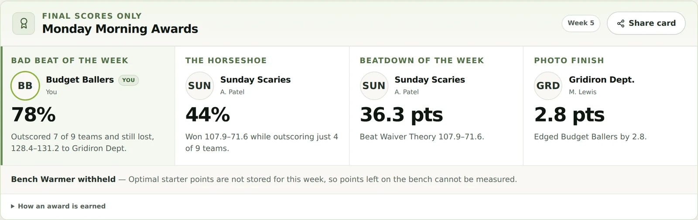

<p align="center">
  
</p>

<h1 align="center">Laces Out</h1>

<p align="center">
  <strong>Self-hosted fantasy football intelligence for leagues of friends.</strong><br>
  On your server and invite-only. Core sync, projections, decisions, and draft tools work without
  an AI provider; Film Room analysis is optional.
</p>

<p align="center">
  <a href="https://lacesout.app/app">Demo/Tour</a> ·
  <a href="https://lacesout.app/methodology">Methodology</a>
</p>

<p align="center">
  
  
  
  
  
</p>

---

## What it does

- **Read-only league sync** — ESPN private leagues sync through a revocable one-click bookmark or the signed
  [Chrome companion](https://chromewebstore.google.com/detail/laces-out-espn-bridge/hmilkmcjlkpnigcfnlfogeafacjpmkbj).
  Yahoo OAuth and sync are implemented and remain labeled **Coming Soon** until enabled for a
  deployment. Laces Out never asks for a provider password or executes roster moves.
- **Monday Morning Awards** — every completed week is scored into Bad Beat, The Horseshoe,
  Beatdown, and Photo Finish, with a one-tap share card for the group chat. An award the stored
  evidence cannot support is omitted with its reason.
- **Forecasts and decisions** — backtested weekly projections use nflverse identity, schedule,
  stats, injuries, rosters, and snap counts, scored to each league's exact rules. Fresh provider and
  projection inputs feed the on-demand engines; accepted league changes also enqueue updated lineup,
  waiver, trade, opponent, and roster-strength recommendations.
- **Draft day** — persistent snake and auction rooms use an append-only event ledger with
  inflation, scarcity, wait risk, max-bid math, undo, replay, and a browser-local Practice Room.
  Manual shared rooms are ready now; ESPN live-board ingest remains off by default until it passes
  real draft-room validation.
- **Ad-hoc research** — Stats Center serves every admitted weekly field over any week range:
  volume, scored production, and derived efficiency (air yards, EPA, PACR, WOPR, CPOE), plus a
  per-player profile with a week-by-week game log. Unsupported or coverage-uncertain metrics remain
  explicitly unavailable instead of becoming plausible zeroes.
- **Matchup Outlook** — league-scored matchup context, near-term and playoff windows, and
  legal-lineup bye pressure for your roster. A bye is asserted only where the admitted schedule
  covers both the team and week; matchup context stays descriptive unless locked historical
  validation admits directional language.
- **Your own edge** — private rankings, ADP, auction values, cheat sheets, custom projections,
  Sleeper momentum, and Fantasy Football Calculator markets sharpen the built-in engine without
  obscuring provenance.
- **Film Room AI** — included Gemini analysis plus encrypted BYOK support for OpenAI, Anthropic,
  Gemini, and OpenRouter. Answers are grounded in league facts and deterministic recommendations;
  models receive no provider credentials, SQL access, or write capability. Start/sit may use one
  fixed, server-authorized, read-only lineup tool whose league and member scope the model cannot
  choose or widen.

## Screenshots

Every view below is the built-in locker room tour—no account required.

|                                                                         |                                                           |
| ----------------------------------------------------------------------- | --------------------------------------------------------- |
|    |      |
|                  |  |
|  |                                                           |

## Statistically honest projections

Laces Out publishes a forecast only after it earns the right:

- Locked, strictly prior walk-forward backtests compare each position model with a transparent
  recency baseline under the league's scoring rules. Until the richer model wins, the baseline
  remains live.
- Forecasts carry calibrated intervals, audited coverage, pinned input checksums, training cutoffs,
  and visible backtest metrics. Missing, stale, or in-flight inputs fail closed.
- Rest-of-season cells graduate independently by position and horizon through pre-registered
  evidence gates and explicit admission. Everything else stays withheld.

See [Projection methodology](./packages/projections/README.md).

## Quick start

Requirements: Docker with the Compose plugin. Images build locally from the checked-out source.
As a practical starting point, allow 4 GB RAM and 8 GB free disk for the source build, then at least
2 GB RAM for normal operation. The stack defines five long-running services—PostgreSQL, API,
worker, web, and Caddy—plus a one-shot migration container. The current release is validated on
amd64; arm64 is not yet release-tested.

```bash
git clone https://github.com/mwardio/laces-out.git
cd laces-out
# For a repeatable deployment, check out a published release instead of tracking main.
VERSION=v1.0.0 # choose the release you intend to run
git checkout "$VERSION"
cp .env.docker.example .env
# Replace every replace-with-... value; generator commands are in the file.
docker compose config --quiet
docker compose up --build -d --wait
curl --fail http://localhost:3000/health/ready
```

Production startup rejects placeholder secrets and the default database password.

Create the first administrator without storing its password in `.env`:

```bash
read -rsp "Owner password: " OWNER_PASSWORD && echo
docker compose run --rm --no-deps \
  -e OWNER_EMAIL="owner@example.com" \
  -e OWNER_DISPLAY_NAME="League Admin" \
  -e OWNER_PASSWORD="$OWNER_PASSWORD" \
  migrate node apps/api/dist/create-owner.js
unset OWNER_PASSWORD
```

Open <http://localhost:3000>. Set `REGISTRATION_INVITE_CODE` to enable shared-code registration;
admins can also issue expiring, single-use invitations.

For upgrades, backups, password resets, and health checks, use
[docs/operations.md](./docs/operations.md). Read [docs/security.md](./docs/security.md) before
exposing a deployment to the internet.

## Configuration

Compose settings are documented in [.env.docker.example](./.env.docker.example); local-development
settings live in [.env.example](./.env.example).

| Variable                                  | Required   | Default                 | Purpose                                                    |
| ----------------------------------------- | ---------- | ----------------------- | ---------------------------------------------------------- |
| `PUBLIC_URL`                              | Production | `http://localhost:3000` | Browser-visible origin; rebuild images after changing it   |
| `POSTGRES_PASSWORD`                       | Yes        | —                       | PostgreSQL password; production rejects placeholders       |
| `SESSION_SECRET`                          | Yes        | —                       | Session and capability-key derivation                      |
| `CREDENTIAL_ENCRYPTION_KEY`               | Yes        | —                       | `base64:`-prefixed 32-byte AES-256-GCM key                 |
| `REGISTRATION_INVITE_CODE`                | No         | empty                   | Shared registration code; blank disables `/register`       |
| `GEMINI_API_KEY`                          | No         | empty                   | Enables included Film Room access                          |
| `MANAGED_AI_DAILY_REQUEST_LIMIT`          | No         | `50`                    | Included AI requests per member per UTC day                |
| `MANAGED_AI_MAX_OUTPUT_TOKENS`            | No         | `2000`                  | Included AI response limit                                 |
| `VAPID_PUBLIC_KEY` / `VAPID_PRIVATE_KEY`  | No         | empty                   | Enables game day push alerts; blank disables them cleanly  |
| `VAPID_SUBJECT`                           | No         | empty                   | `mailto:` or `https:` contact required with the VAPID keys |
| `NEXT_PUBLIC_CONTACT_EMAIL`               | No         | empty                   | Public operator contact; set before internet exposure      |
| `NEXT_PUBLIC_CLOUDFLARE_ANALYTICS`        | No         | `disabled`              | Discloses separately enabled hosted Cloudflare analytics   |
| `NEXT_PUBLIC_YAHOO_ACCESS_STATUS`         | No         | `pending`               | Controls the public **Coming Soon** state                  |
| `YAHOO_CLIENT_ID` / `YAHOO_CLIENT_SECRET` | No         | empty                   | Yahoo OAuth credentials, API server only                   |
| `GATEWAY_BIND_ADDRESS`                    | No         | `0.0.0.0`               | Host address used by both gateway port mappings            |
| `SITE_ADDRESS`                            | No         | `:80`                   | Included Caddy site address                                |
| `APP_PORT` / `HTTPS_PORT`                 | No         | `3000` / `3443`         | Included gateway host ports                                |
| `POSTGRES_PORT`                           | No         | `55432`                 | Loopback-only PostgreSQL maintenance port                  |
| `LOG_LEVEL`                               | No         | `info`                  | API and worker log level                                   |

For a standalone public deployment, point a domain at the host and set `PUBLIC_URL`,
`SITE_ADDRESS`, `APP_PORT`, and `HTTPS_PORT` as described in `.env.docker.example`.

If another reverse proxy already owns ports 80 and 443, keep the included gateway on an
unprivileged loopback port:

```dotenv
PUBLIC_URL=https://laces.example.com
GATEWAY_BIND_ADDRESS=127.0.0.1
SITE_ADDRESS=:80
APP_PORT=3000
HTTPS_PORT=3443
```

Point the outer proxy at `http://127.0.0.1:3000`, preserve the original host and scheme headers,
and expose only that gateway—not the API, web, or PostgreSQL services. `PUBLIC_URL` remains the
canonical origin for cookies, invitations, OAuth callbacks, and metadata.

## Outbound services

The Compose application contains no advertising or product-analytics client, and its default CSP
does not permit an analytics beacon. Sync and research necessarily contact the selected data
sources; AI traffic occurs only when Film Room is configured or a member supplies a personal key.

| Service                          | Purpose                                               | Account or key                                 |
| -------------------------------- | ----------------------------------------------------- | ---------------------------------------------- |
| nflverse                         | NFL identity, schedule, stats, rosters, and snap data | None                                           |
| Sleeper                          | Player catalog, status context, and market trend      | None; Sleeper league sync is not implemented   |
| Fantasy Football Calculator      | Draft-market ADP context                              | None                                           |
| ESPN                             | Authorized private-league sync                        | Existing browser session; password stays local |
| Google Gemini                    | Optional operator-provided Film Room access           | Server-side Google AI Studio key               |
| OpenAI, Anthropic, or OpenRouter | Optional member-selected Film Room provider           | Encrypted member-supplied key                  |
| Yahoo                            | Optional read-only league sync when enabled           | Deployment-owned Yahoo developer credentials   |

## Architecture

```text
Browser ──> Caddy ──> Next.js web
                  └─> Fastify API ──> PostgreSQL
                                      ↑
Provider and NFL sources ──> adapters ─┴─ pg-boss worker
                                      └─ decision engines
```

- `apps/web` — responsive Next.js 16 PWA
- `apps/api` — authentication, provider sync, ingestion, and REST endpoints
- `apps/worker` — refresh schedules, forecast sweeps, markets, and job processing
- `apps/espn-bridge` — Manifest V3 companion for private ESPN league sync
- `packages/*` — provider adapters, domain contracts, projections, rankings, security, and
  draft/lineup/waiver/trade engines

Provider code ends at its adapter. Recommendation engines consume normalized, source-stamped domain
data rather than raw provider payloads.

## Development

Requires Node.js `>=22.22 <25`, Docker, and PostgreSQL 17+.

```bash
cp .env.example .env
docker compose up -d postgres
npm install
npm run db:migrate -w @fantasy/db
npm run dev
```

Web runs at <http://localhost:3000>; the API runs at <http://localhost:4000>.

| Command              | Purpose                                              |
| -------------------- | ---------------------------------------------------- |
| `npm run dev`        | Start web, API, and worker with live reload          |
| `npm run check`      | Format, lint, typecheck, tests, and production build |
| `npm run test`       | Run the Vitest suite                                 |
| `npm run test:watch` | Run Vitest in watch mode                             |
| `npm run build`      | Build API, worker, ESPN companion, and web           |
| `npm run format`     | Apply Prettier formatting                            |

Database-backed smoke commands and the release runbook live in
[docs/operations.md](./docs/operations.md).

## Security and privacy

- Provider access is read-only; the ESPN path never asks for a password.
- Accounts use Argon2id hashes and revocable server-side sessions with secure production cookies.
- Provider credentials use versioned AES-256-GCM envelopes; bridge devices are independently
  revocable.
- Push devices are listed and revoked per member; their endpoints and keys are never returned by an
  API response, never logged, and pruned automatically when a push service reports them gone.
  Notifications carry only league facts the member can already see.
- Logs redact secrets, cookies, authorization headers, and OAuth callback values.
- AI providers receive no credentials, SQL access, or write capability. Start/sit may use one
  fixed, membership-scoped, read-only lineup tool; prompts and answers are not persisted.

See [docs/security.md](./docs/security.md) and [docs/privacy.md](./docs/privacy.md).

## Provider status

| Provider   | Status                                                                                                           |
| ---------- | ---------------------------------------------------------------------------------------------------------------- |
| **ESPN**   | Private leagues sync through the bookmark or browser companion; passwords and cookies stay in the browser        |
| **Yahoo**  | Official read-only OAuth and sync are implemented; deployments show **Coming Soon** until the feature is enabled |
| **Writes** | Disabled everywhere; Laces Out recommends and deep-links, and members complete actions at the provider           |

Provider evidence and limitations live in [docs/provider-notes/](./docs/provider-notes/).

## Status

Weekly managed projections are the production forecast source. Rest-of-season output is served only
for cells that pass their evidence gates; demo data is always labeled. Manual shared snake and
auction rooms are production-ready. ESPN live-board ingest is implemented behind an off-by-default
flag and remains inactive until its real draft-room validation passes. Ongoing work focuses on
provider hardening, recommendation validation, and operational resilience.

## FAQ

**Does ESPN sync require Chrome?** No. The on-demand one-click bookmark does not require the
extension. Automatic background refresh uses the signed Chrome companion.

**Can it sync Sleeper leagues?** Not currently. Sleeper supplies no-auth player and market context;
ESPN is the active league provider, and Yahoo support is implemented but deployment-gated.

**Why several containers?** The one-shot migration, database, API, background worker, web
application, and gateway have separate lifecycle and network boundaries. Compose starts and
coordinates the whole stack.

**Does AI have to be enabled?** No. Deterministic projections, league analytics, lineup and waiver
logic, trade analysis, and draft tools remain available without an AI key.

## Documentation

| Document                                                                           | Purpose                                           |
| ---------------------------------------------------------------------------------- | ------------------------------------------------- |
| [docs/operations.md](./docs/operations.md)                                         | Deployment, backups, health, and operator runbook |
| [docs/security.md](./docs/security.md)                                             | Threat model and hardening baseline               |
| [docs/privacy.md](./docs/privacy.md)                                               | Operator privacy source of truth                  |
| [docs/ros-v6-2026-untouched-protocol.md](./docs/ros-v6-2026-untouched-protocol.md) | Frozen final-proof protocol for the ROS engine    |
| [docs/provider-notes/](./docs/provider-notes/)                                     | Provider evidence and constraints                 |
| [apps/espn-bridge/README.md](./apps/espn-bridge/README.md)                         | Browser companion pairing and store submission    |
| [packages/projections/README.md](./packages/projections/README.md)                 | Model internals and evaluation methodology        |

## License

[MIT](./LICENSE)
