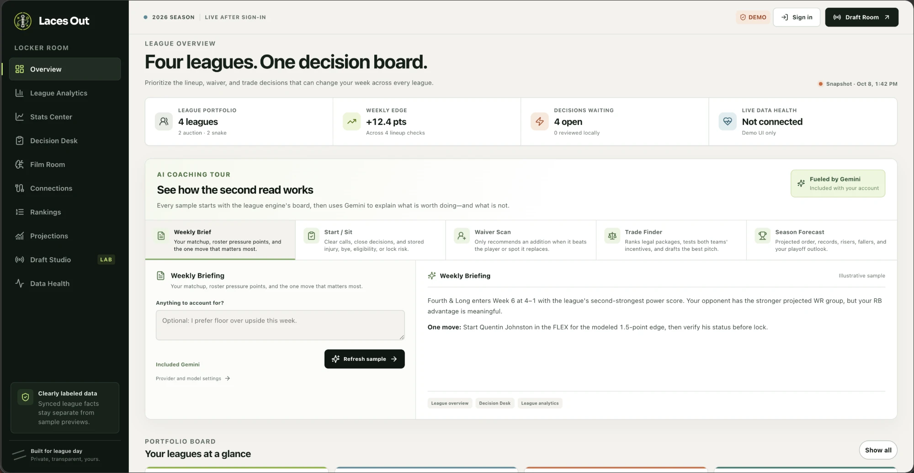
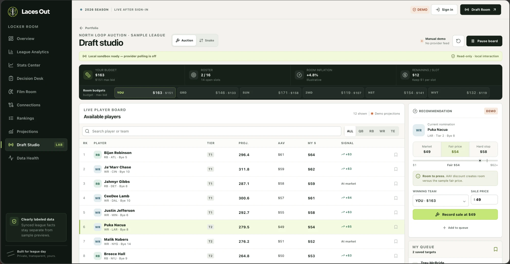
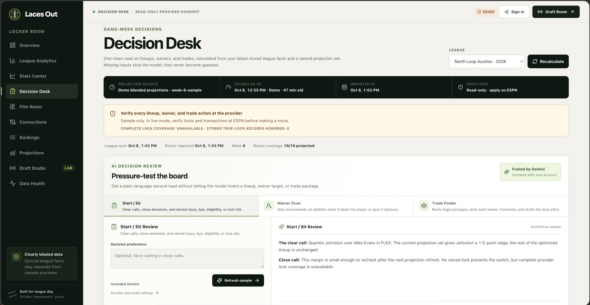
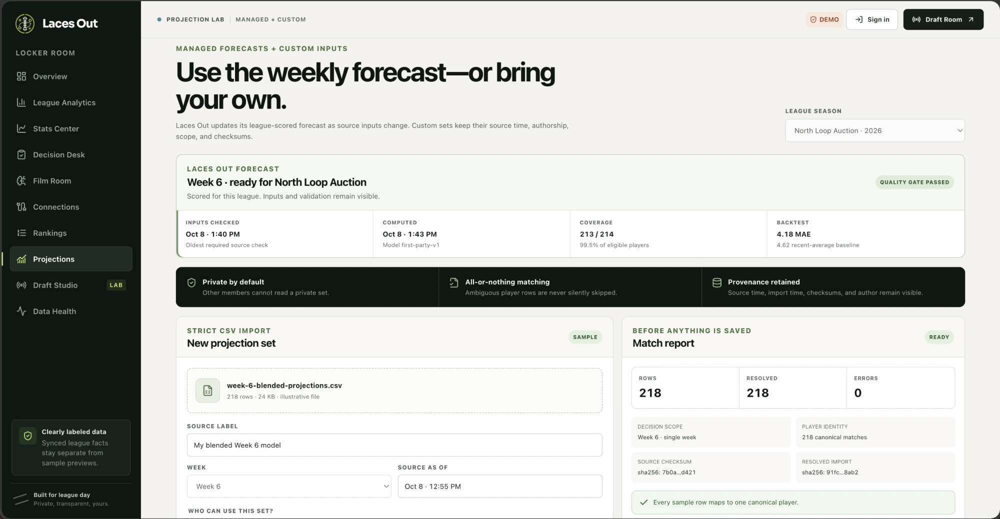
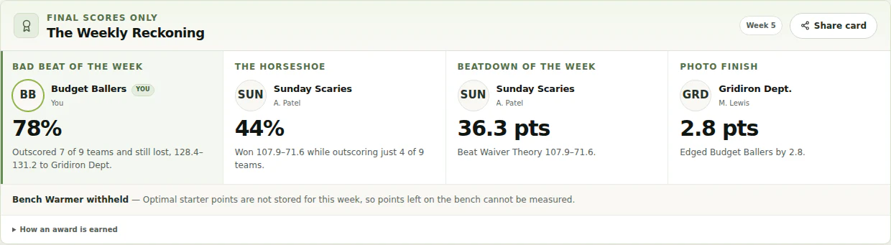

<p align="center">
  
</p>

<h1 align="center">Laces Out</h1>

<p align="center">
  <strong>Self-hosted fantasy football tools for leagues of friends.</strong><br>
  League sync, projections, draft rooms, weekly decisions, and optional AI analysis. Everything runs on your own server, with invite-only access if you want it.
</p>

<p align="center">
  <a href="https://lacesout.app/app">Demo/Tour</a> ·
  <a href="https://lacesout.app/methodology">Methodology</a>
</p>

<p align="center">
  
  
  
  
  
</p>

---

I play in too many fantasy leagues, most with auction drafts, and got tired of paying for tools that
still felt generic. Laces Out is the app I wanted instead: one private place for league data,
draft prep, weekly decisions, and the research behind them. The core app works without AI, and Film
Room adds optional managed or BYOK analysis.

## What it does

- **League sync** — private Yahoo leagues connect through official OAuth, while ESPN leagues sync
  through the signed
  [Chrome companion](https://chromewebstore.google.com/detail/laces-out-espn-bridge/hmilkmcjlkpnigcfnlfogeafacjpmkbj).
  Self-hosted instances pair with the same companion through a one-time code, with no custom
  extension build required. An operator can also offer always-on ESPN refresh: the companion
  passes the existing ESPN session authorization once, Laces Out encrypts it at rest, and scheduled
  read-only refreshes no longer depend on Chrome being awake. Device-only companion sync remains
  available, and Laces Out never asks for a provider password or changes a roster.
- **Weekly decisions** — league-scored projections drive lineup, waiver, trade, opponent, and
  roster-strength analysis. When the league changes, the recommendations refresh with it.
- **Snake and auction drafts** — shared rooms track inflation, scarcity, wait risk, maximum bids,
  nominations, and roster construction, with undo, replay, and a browser-local Practice Room.
- **The Weekly Reckoning** — Bad Beat, The Horseshoe, Beatdown, and Photo Finish turn final scores
  into shareable awards and league receipts. If the data cannot support one, Laces Out says so. Any
  completed week can also get one shared, saved trash-talk recap, tuned by League Intel notes and a
  commissioner-set tone from mild to scorched.
- **Research and Matchup Outlook** — explore weekly production, advanced efficiency, and game logs,
  then look ahead at opponent context, playoff windows, and bye pressure.
- **Your own rankings** — import or edit rankings, ADP, auction values, cheat sheets, and custom
  projections, with Sleeper momentum and Fantasy Football Calculator market context.
- **Optional AI** — Film Room uses shared Gemini, while a host can route included Medium and
  Scorched recaps through Grok 4.3 on OpenRouter. Members can instead use an encrypted personal
  OpenAI, Anthropic, Gemini, DeepSeek, Grok, or OpenRouter key. Models explain league facts and
  computed recommendations; they cannot access credentials, query the database, or make
  transactions.

## Screenshots

Every view below comes from the built-in locker room tour—no account required.

|                                                                       |                                                           |
| --------------------------------------------------------------------- | --------------------------------------------------------- |
|  |      |
|                |  |

<p align="center"><strong>The Weekly Reckoning</strong> turns final scores into shareable league receipts, then writes the recap.</p>



## Projections have to earn their way onto the page

I do not want Laces Out publishing confident-looking numbers just because a model produced them.

- Locked, strictly prior walk-forward backtests compare each position model with a simple recency
  baseline. If the richer model does not win, the baseline stays live.
- Forecasts carry calibrated intervals, input checksums, training cutoffs, and visible backtests.
- Rest-of-season forecasts graduate by position and horizon. Missing, stale, or unproven output
  stays hidden.

The details, formulas, and current evidence are in
[Projection methodology](./packages/projections/README.md).

## Current limits

Yahoo and ESPN league sync are read-only. ESPN live-draft ingest is implemented but disabled until
it passes real snake and auction room validation. ESPN exposes no supported third-party Fantasy
authorization contract, so its always-on and anonymous server reads are unofficial,
default off, and operator-controlled. Provider writes are intentionally unsupported: Laces Out
recommends the move; you make it at ESPN or Yahoo.

## Quick start

The shortest path to a local install is Docker Compose. Allow 4 GB of RAM and 8 GB of free disk
while the images build, then about 2 GB of RAM for normal operation. I have release-tested amd64;
arm64 may work, but it has not been release-tested yet.

```bash
git clone https://github.com/mwardio/laces-out.git
cd laces-out

cp .env.docker.example .env
# Replace every replace-with-... value; generator commands are included in the file.
docker compose config --quiet
docker compose up --build -d --wait
curl --fail http://localhost:3000/health/ready
```

Production startup refuses placeholder secrets and the default database password. For a long-lived
deployment, check out a release tag you have reviewed instead of following a moving branch; the
update runbook covers backups, migrations, and rollback.

Create the first admin account without storing its password in `.env`:

```bash
read -rsp "Owner password: " OWNER_PASSWORD && echo
docker compose run --rm --no-deps \
  -e OWNER_EMAIL="owner@example.com" \
  -e OWNER_DISPLAY_NAME="League Admin" \
  -e OWNER_PASSWORD="$OWNER_PASSWORD" \
  migrate node apps/api/dist/create-owner.js
unset OWNER_PASSWORD
```

Open <http://localhost:3000>. To let friends register, set a shared
`REGISTRATION_INVITE_CODE` or enable `REGISTRATION_OPEN`. Admins can also create expiring,
single-use invitation links.

For upgrades, backups, password resets, and health checks, see
[docs/operations.md](./docs/operations.md). Read [docs/security.md](./docs/security.md) before
putting an installation on the public internet.

## Configuration

The complete reference is in [.env.docker.example](./.env.docker.example); local-development
settings are in [.env.example](./.env.example).

| Variable                                  | What it controls                                      |
| ----------------------------------------- | ----------------------------------------------------- |
| `PUBLIC_URL`                              | Public origin for cookies, links, OAuth, and metadata |
| `POSTGRES_PASSWORD`                       | PostgreSQL password                                   |
| `SESSION_SECRET`                          | Sessions and capability-key derivation                |
| `CREDENTIAL_ENCRYPTION_KEY`               | AES-256-GCM key for stored credentials                |
| `REGISTRATION_OPEN`                       | Code-free registration; defaults `false`              |
| `REGISTRATION_INVITE_CODE`                | Shared-code registration; ignored when open           |
| `GEMINI_API_KEY`                          | Shared Film Room access                               |
| `OPENROUTER_API_KEY`                      | Shared Medium/Scorched Reckoning recaps               |
| `VAPID_PUBLIC_KEY` / `VAPID_PRIVATE_KEY`  | Game-day push alerts                                  |
| `YAHOO_CLIENT_ID` / `YAHOO_CLIENT_SECRET` | Yahoo OAuth when enabled                              |
| `NEXT_PUBLIC_YAHOO_ACCESS_STATUS`         | Set to `available` when Yahoo OAuth is ready          |
| `YAHOO_AUTOMATED_SYNC_ENABLED`            | Unattended Yahoo reads; defaults `false`              |
| `ESPN_PUBLIC_DIRECT_SYNC_ENABLED`         | Evidence-gated anonymous ESPN reads; defaults `false` |
| `ESPN_SERVER_SESSION_SYNC_ENABLED`        | Opt-in encrypted ESPN session reads; defaults `false` |

If you're using a reverse proxy (Caddy, Traefik, etc.), keep the included gateway on an unprivileged
loopback port:

```dotenv
PUBLIC_URL=https://laces.example.com
GATEWAY_BIND_ADDRESS=127.0.0.1
SITE_ADDRESS=:80
APP_PORT=3000
HTTPS_PORT=3443
```

Point the outer proxy at `http://127.0.0.1:3000`, preserve the original host and scheme, and expose
only that gateway—not the API, web, or PostgreSQL services.

## What it connects to

There is no advertising or product-analytics client by default. Sync, research, and optional Film
Room requests still need to reach their data sources.

| Service                              | What Laces Out uses it for                                      | Account or key                                       |
| ------------------------------------ | --------------------------------------------------------------- | ---------------------------------------------------- |
| nflverse                             | NFL identity, schedules, stats, rosters, and snaps              | None                                                 |
| Sleeper                              | Player catalog, status context, and market trends               | None; Sleeper league sync is not implemented         |
| Fantasy Football Calculator          | Draft-market ADP context                                        | None                                                 |
| ESPN                                 | Scoped device sync; always-on/private and verified public reads | Browser session or encrypted confirmed authorization |
| Google Gemini                        | Shared Film Room and Mild recap provider; optional BYOK         | Host key or encrypted user-supplied key              |
| OpenRouter / xAI Grok                | Shared Medium/Scorched recap route; optional OpenRouter BYOK    | Host key or encrypted user-supplied key              |
| OpenAI, Anthropic, DeepSeek, or Grok | Optional user-selected Film Room provider                       | Encrypted user-supplied key                          |
| Yahoo                                | Optional read-only league sync when enabled                     | Yahoo app credentials configured by the host         |

## Under the hood

```text
Browser ──> Caddy ──> Next.js web
                  └─> Fastify API ──> PostgreSQL
                                      ↑
Provider and NFL sources ──> adapters ─┴─ pg-boss worker
                                      └─ decision engines
```

- `apps/web` — responsive Next.js 16 PWA
- `apps/api` — authentication, provider sync, ingestion, and REST endpoints
- `apps/worker` — refresh schedules, forecast sweeps, markets, and background jobs
- `apps/espn-bridge` — Manifest V3 sync agent, live draft observer, and always-on ESPN authorization
- `packages/*` — provider adapters, domain contracts, projections, rankings, security, and the
  draft, lineup, waiver, and trade engines

Provider-specific code stops at its adapter. Everything downstream uses normalized, source-stamped
data.

## Development

Requires Node.js `>=22.22 <25`, Docker, and PostgreSQL 17+.

```bash
cp .env.example .env
docker compose up -d postgres
npm install
npm run db:migrate -w @fantasy/db
npm run dev
```

The web app runs at <http://localhost:3000>; the API runs at <http://localhost:4000>. Run
`npm run check` for formatting, lint, typecheck, tests, and the production build. Database smoke
commands and the release runbook are in [docs/operations.md](./docs/operations.md).

## Security and privacy

Laces Out touches real fantasy accounts, so I take the boring security details seriously.

- Provider access is read-only. Yahoo uses official OAuth, and every ESPN path avoids the password;
  the optional unattended mode stores only encrypted session authorization and is revocable.
- Passwords use Argon2id, sessions are server-side and revocable, and stored credentials use
  versioned AES-256-GCM envelopes.
- Logs redact secrets, cookies, authorization headers, and OAuth callback values.
- AI providers receive no fantasy credentials, SQL access, or write capability. Questions and
  one-off answers are not stored. Shared Weekly Reckoning recaps and League Intel notes are stored as
  league data.

The full threat model and operator guidance are in [docs/security.md](./docs/security.md) and
[docs/privacy.md](./docs/privacy.md).

## Documentation

Start with [operations](./docs/operations.md), [security](./docs/security.md), and
[privacy](./docs/privacy.md). Provider constraints live in
[provider notes](./docs/provider-notes/); model details live in
[projection methodology](./packages/projections/README.md). The
[architecture decisions](./docs/architecture/) explain the major system boundaries.

## License

[MIT](./LICENSE)
