# ESPN Live Draft Sync Implementation Plan

Status: implemented behind `ESPN_LIVE_DRAFT_SYNC` (default off); Work Packages 0 and 5 outstanding  
Last updated: 2026-07-24  
Target: production-ready before the 2026 Laces Out league drafts  
Primary surfaces: ESPN Bridge, Draft Studio, API, draft engine, PostgreSQL

## Contents

- [Objective and decision](#1-objective)
- [Current implementation and scope](#3-current-implementation-and-exact-gap)
- [Architecture and user journeys](#6-proposed-architecture)
- [Browser extraction and extension protocol](#8-browser-extraction-contract)
- [API, persistence, identity, and source failover](#10-server-ingest-api)
- [Reconciliation and draft-service changes](#14-reconciliation-algorithm)
- [Web UX, reliability, and operations](#16-web-application-and-ux)
- [Testing and implementation work packages](#19-testing-strategy)
- [Rollout, acceptance criteria, and rollback](#21-feature-flags-and-rollout)
- [File map, risks, and user inputs](#24-expected-file-map)
- [Execution checklist and definition of done](#27-execution-checklist)

## 1. Objective

Add read-only, near-real-time ESPN draft synchronization to Laces Out so that picks from a live
ESPN snake or salary-cap draft automatically update the shared Laces Out Draft Studio.

The finished experience should:

- follow completed snake picks, keepers, auction nominations, high bids, sales, prices, and draft
  completion without manual re-entry;
- update Laces Out recommendations within seconds of an ESPN draft event;
- let one authorized desktop browser supply the shared feed while every authorized league member,
  including mobile users, sees the same current draft;
- preserve the existing manual draft ledger as a dependable fallback;
- recover safely from page reloads, extension restarts, missed events, ESPN pauses, pick rollbacks,
  and a second bridge taking over;
- never read, store, log, or transmit ESPN passwords, cookies, `SWID`, `espn_s2`, draft security
  tokens, WebSocket URLs, chat, or raw page HTML; and
- fail closed when ESPN markup or identifiers cannot be interpreted confidently.

This plan is deliberately self-contained so future implementation work can proceed without
repeating the investigation.

## 2. Executive decision

The feature is feasible, but normal league API polling is not the correct live transport.

The existing bridge asks ESPN for `mDraftDetail` after a core league sync. That view is useful for
completed and on-demand draft results, but it is not the transport used by ESPN's live draft room.
ESPN's current draft client receives live state over a dedicated WebSocket with an EventSource
fallback. Historical third-party implementations and reports also show that repeatedly requesting
`mDraftDetail` does not reliably expose picks while the draft is active.

Laces Out should therefore use a narrowly scoped Chrome content script that passively observes the
state ESPN has already rendered in the user's draft-room tab. It should send only a bounded,
sanitized representation of the draft to the existing bridge service worker. The service worker
then uploads authenticated observations through the existing league-scoped Laces Out bridge
credential.

The first implementation must not intercept, proxy, decode, or transmit ESPN's draft WebSocket.
It must not inject hooks into ESPN's network stack. DOM observation plus periodic full
reconciliation is the safer boundary and is consistent with the read-only architecture.

## 3. Current implementation and exact gap

### 3.1 What already exists

The repository already has most of the downstream machinery:

- a Manifest V3 ESPN companion with explicit ESPN host access;
- one-click pairing and a revocable device token scoped to specific numeric ESPN league IDs;
- browser-local ESPN authentication where cookies remain attached by Chrome and never cross into
  Laces Out;
- on-demand and six-hour core league refresh;
- isolated ESPN supplemental feeds for availability, box scores, transactions, and
  `mDraftDetail`;
- strict ESPN schemas, bounded response sizes, checksums, idempotent receipts, and last-known-good
  behavior;
- normalized completed snake and auction draft results, including auction price, nominating team,
  and keeper state;
- a persistent, event-sourced manual draft service;
- deterministic snake and auction reducers with roster, order, budget, minimum-bid, duplicate
  player, and maximum-bid invariants;
- correction and undo events;
- a Draft Studio that reloads its shared app ledger every five seconds; and
- mobile and desktop Draft Studio views built from the same server snapshot.

### 3.2 What is intentionally absent

The current draft contract is explicitly manual:

- draft settings store `transport: "manual"` and `providerPolling: false`;
- persisted draft events have `source: "manual"`;
- only owners and commissioners may create or mutate manual draft rooms;
- the web client's five-second loop reloads the Laces Out ledger, not ESPN;
- the extension has no ESPN draft-room content script;
- the extension's automatic ESPN refresh runs every six hours;
- supplemental `mDraftDetail` snapshots are stored independently and are not converted into the
  active draft event stream; and
- no API endpoint accepts high-cadence live draft observations.

### 3.3 Evidence from the current ESPN client

The current ESPN draft bundle constructs a WebSocket connection to a dedicated fantasy draft host,
falls back to EventSource, and decodes its own draft messages in the page. This is implementation
evidence, not a supported ESPN API contract:

- ESPN draft page: <https://fantasy.espn.com/football/draft>
- Current inspected bundle:
  <https://cdn1.espn.net/kona/92ddde539219-1.441/_next/48a5b304-5d58-4b12-a3f0-a4a49541a118/page/football/draft.js>
- Open-source `mDraftDetail` implementation evidence:
  <https://github.com/cwendt94/espn-api/blob/master/espn_api/football/league.py>
- Chrome alarm behavior:
  <https://developer.chrome.com/docs/extensions/reference/api/alarms>

The hashed ESPN asset URL will change. It is recorded only to document the July 2026 investigation,
not as an application dependency.

## 4. Scope

### 4.1 Required for the first production release

- ESPN snake drafts.
- ESPN salary-cap/auction drafts.
- ESPN keepers visible in the live room.
- Provider pick ownership, including nonstandard or traded pick ownership when ESPN exposes it.
- Late join and page reload recovery.
- ESPN pause/resume state.
- Pick rollback and correction reconciliation.
- Current auction nomination, current high bidder, and current high bid when visible.
- Completed auction winner and sale price.
- Shared updates for desktop and mobile Laces Out viewers.
- One active source device with automatic standby/failover.
- Stale-feed warnings and explicit manual fallback.
- Post-draft reconciliation against the existing `mDraftDetail` snapshot.
- Feature flag, diagnostics, metrics, documentation, and a clean Chrome Web Store package.

### 4.2 Explicitly out of scope

- Making picks, nominations, bids, pauses, rollbacks, or any other write on ESPN.
- Reading or replaying ESPN credentials, cookies, local storage, authorization headers, draft
  security tokens, WebSocket frames, or EventSource URLs.
- Mobile-browser ESPN capture. Chrome extensions are a desktop integration.
- Claiming official ESPN OAuth or official ESPN API support.
- Yahoo live draft sync in the same implementation slice.
- Copying ESPN chat or message-board content.
- Retaining raw ESPN page HTML.
- Depending on the start of the 2026 regular season for validation.
- Treating DOM selectors as permanently stable.

## 5. Fixed product and security decisions

1. **Read-only stays absolute.** The bridge observes a draft and updates advice. It never submits a
   provider action.
2. **One desktop source can serve the league.** The ESPN draft room and extension must be open in
   at least one authorized desktop Chrome profile. Other Laces Out viewers may use any supported
   device.
3. **No commissioner approval is added.** Any existing authorized league member with a valid,
   league-scoped ESPN bridge may supply current provider observations. Manual overrides remain
   restricted because they change shared state.
4. **Provider facts and manual facts are distinguishable.** Every accepted event retains its
   source and observation provenance.
5. **No silent guessing.** Unknown team or player identity pauses that event and displays a
   recoverable mapping issue. A wrong pick is worse than a briefly stale board.
6. **Manual fallback remains first class.** A provider-backed room can enter a clearly labeled
   manual backup mode if live sync becomes stale. Provider updates do not silently overwrite
   manual backup work.
7. **Completed ESPN results are the closing audit.** The existing normalized `mDraftDetail` feed
   verifies the final order, teams, keepers, auction prices, and completion state after ESPN
   publishes it.
8. **Do not market before validation.** Landing-page copy may claim live ESPN draft sync only after
   the release gates in this plan pass.

## 6. Proposed architecture

```mermaid
flowchart LR
  ESPN[ESPN draft room DOM] --> CS[Scoped content script]
  CS --> SW[ESPN Bridge service worker]
  SW -->|device token + sanitized observation| API[Bridge ingest API]
  API --> VAL[Validation and identity mapping]
  VAL --> REC[Provider draft reconciler]
  REC --> DB[(Draft events + feed state)]
  DB --> RT[Authenticated event stream]
  RT --> WEB[Laces Out Draft Studio]
  WEB --> ENG[Deterministic draft advisor]
```



### 6.1 Why this boundary

- ESPN continues to own sign-in and its live transport.
- The content script reads only already-rendered fantasy draft facts.
- The service worker remains the sole holder of the Laces Out device credential.
- The server independently authorizes the device, league, season, session, and payload.
- All consumers use the existing Laces Out draft engine instead of trusting provider prose or
  client-side calculations.
- Mobile clients do not need ESPN credentials or extension support.

## 7. User journeys

### 7.1 Desktop source user

1. The user has already paired the ESPN Bridge with the relevant league.
2. The user opens the ESPN draft room in Chrome.
3. The content script recognizes the configured league and reports `waiting`, `live`, `paused`, or
   `complete`.
4. Laces Out creates or reopens one shared ESPN-backed draft session for that league season.
5. The Draft Studio shows **Live ESPN Sync** with a current freshness indicator.
6. Each completed pick or sale updates the shared Laces Out board and recommendations.
7. The extension stops high-cadence observation after ESPN marks the draft complete.
8. A normal supplemental sync later compares the completed `mDraftDetail` result with the live
   ledger.

No second pairing, copied token, or provider login form is introduced.

### 7.2 Mobile or non-source league member

1. The user opens the same league's Draft Studio from a phone or another computer.
2. The UI shows that an ESPN bridge is supplying the live feed.
3. Updates arrive from Laces Out's API; the viewer does not need the extension.
4. If the source browser goes stale, every viewer sees the same warning and last accepted time.
5. When a source resumes or a standby bridge takes over, the shared room reconciles automatically.

### 7.3 Manual backup

1. The feed exceeds the stale threshold or an identity cannot be mapped.
2. The UI keeps the last valid provider state and explains the exact problem.
3. An owner or commissioner may activate **Manual Backup Mode**.
4. Manual events continue from the last accepted provider state with explicit source labels.
5. Returning provider observations are held for comparison rather than applied silently.
6. The operator reviews a concise difference before returning to provider-controlled mode.

## 8. Browser extraction contract

### 8.1 Content script

Add a static Manifest V3 content script scoped to the current ESPN football draft routes under
`https://fantasy.espn.com/*`. The extension already declares that host, so the implementation
should not require broader host access.

The script should:

- activate only on recognized ESPN football draft pages;
- determine league ID and season from browser-attested URL/page state, then require both to match
  the stored bridge configuration;
- use a `MutationObserver` with a short debounce;
- perform a periodic full DOM rescan to recover from missed mutations;
- emit a full sanitized snapshot on initial attach, reconnect, reload, failover, completed pick,
  completed sale, rollback, and completion;
- emit a small heartbeat while the draft remains live;
- emit bounded auction-state updates when nomination/high-bid state changes;
- stop or slow down when the page is unrelated, the draft is complete, or the stored bridge is not
  authorized for that league; and
- never send raw HTML, arbitrary text nodes, script state, chat, or page storage.

### 8.2 Adapter design

Do not scatter ESPN selectors through the service worker. Create an isolated draft-room adapter:

```text
apps/espn-bridge/src/live-draft/
  content-script.ts
  dom-adapter.ts
  dom-contract.ts
  observer.ts
  sanitizer.ts
  status-overlay.ts          # optional, minimal and noninteractive
```

`dom-adapter.ts` should be the only module aware of ESPN selectors and labels. Prefer stable
attributes such as `data-testid`, IDs, link targets, and explicit data attributes. Text matching is
a fallback and must be normalized and covered by fixtures.

Use multiple independently checked signals for critical state:

- league ID from the page URL plus a page value;
- draft type from settings plus visible draft layout;
- pick sequence from explicit pick numbers, not row position alone;
- team identity from provider ID when exposed, otherwise a unique normalized league-team match;
- player identity from provider player ID when exposed, otherwise a unique
  name/pro-team/position match;
- auction price from the explicit winning/sale value, not a generic dollar amount elsewhere; and
- completion from a dedicated completion state plus expected filled roster/pick count.

Virtualized tables are a known risk. The spike must prove that a late join or page reload can
reconstruct every prior pick without scrolling the page manually. If the rendered DOM exposes only
visible rows, the adapter must identify another already-decoded, credential-free page-state surface
or the feature must retain a clearly documented "bridge must be present from the start" limitation.
Do not hide this limitation.

### 8.3 Proposed observation

The exact type belongs in `@fantasy/contracts`, but the target shape is:

```ts
interface EspnLiveDraftObservationV1 {
  schemaVersion: 1;
  kind: "espn-live-draft";
  leagueId: string;
  season: number;
  pageSessionId: string; // extension-generated random UUID; never an ESPN token
  revision: number; // monotonic within the page session
  capturedAt: string;
  state: "waiting" | "live" | "paused" | "complete";
  draftType: "snake" | "auction";
  expectedTeamCount: number;
  expectedRosterSize: number | null;
  pickOwnership: Array<{
    overallPick: number;
    providerTeamId: string | null;
    teamName: string;
  }>;
  picks: Array<{
    sequence: number;
    round: number | null;
    roundPick: number | null;
    keeper: boolean;
    providerTeamId: string | null;
    teamName: string;
    providerPlayerId: string | null;
    playerName: string;
    proTeam: string | null;
    position: string | null;
    price: number | null;
    nominatingProviderTeamId: string | null;
  }>;
  currentAuction: null | {
    nominationNumber: number;
    nominatingProviderTeamId: string | null;
    providerPlayerId: string | null;
    playerName: string;
    proTeam: string | null;
    position: string | null;
    highBidProviderTeamId: string | null;
    highBid: number | null;
  };
  completeness: {
    contiguousThrough: number;
    duplicateSequences: number;
    unresolvedRows: number;
  };
  checksumSha256: string;
}
```

The checksum covers a canonical serialization of the sanitized fields. The server recomputes it.
Raw ESPN markup is never part of the contract.

### 8.4 Bounded behavior

Initial limits:

- maximum body: 1 MiB;
- maximum 32 teams;
- maximum 1,000 picks/sales;
- maximum player/team/name lengths;
- maximum safe integer prices and pick numbers;
- maximum two transient auction-state uploads per second;
- full snapshots only on material changes or recovery;
- heartbeat approximately every five seconds while live; and
- extension queue retains only the latest full snapshot plus the latest transient state.

These values should be constants with unit tests, not magic numbers.

## 9. Extension-to-service-worker protocol

Extend the internal `BridgeRequest` union with narrowly typed messages:

- `LIVE_DRAFT_OBSERVATION`
- `LIVE_DRAFT_HEARTBEAT`
- `LIVE_DRAFT_PAGE_LEFT`
- `GET_LIVE_DRAFT_STATUS`

The service worker must:

1. Validate the sender is an extension content script on an allowlisted ESPN draft URL.
2. Revalidate the observation contract.
3. Require league ID and season to match stored bridge scope.
4. Add the existing Laces Out device credential only in the service worker.
5. Upload to a fixed API path under the configured Laces Out origin.
6. Retry bounded network failures with jitter.
7. Replace queued stale snapshots rather than replaying every intermediate mutation.
8. Store only bounded status and the latest sanitized snapshot needed for retry.
9. Expose useful, nontechnical status in the popup.
10. Never echo the device credential to the content script or page.

The ESPN page is untrusted input. A page mutation must not be able to select another Laces Out
origin, league ID, or device token.

## 10. Server ingest API

Add a machine-authenticated endpoint separate from normal member draft mutations:

```text
POST /v1/bridge/espn/live-draft
Authorization: Bearer <existing league-scoped bridge device token>
Content-Type: application/json
```

The endpoint accepts an observation or heartbeat and returns a bounded status:

```ts
interface EspnLiveDraftIngestResponse {
  status: "accepted" | "idempotent" | "standby" | "held" | "rejected";
  draftId: string | null;
  serverSequence: number | null;
  feedState: "waiting" | "live" | "paused" | "stale" | "complete" | "degraded";
  acceptedChecksum: string | null;
  unresolvedTeams: number;
  unresolvedPlayers: number;
  sourceLeaseExpiresAt: string | null;
}
```

### 10.1 Authorization

Reuse the existing bridge device lookup and token hash verification. Then require:

- active, nonrevoked device;
- exact numeric league ID in device scope;
- matching configured season;
- active league season normalized from an accepted ESPN core snapshot;
- device owner is still an authorized league member;
- league is not archived;
- feature flag enabled; and
- request within device/league rate limits.

The live feed must not require commissioner approval. The provider observation is shared league
state, not a manual action performed on another manager's behalf.

### 10.2 Routes for viewers

Extend the normal draft API with:

- provider-backed session discovery by league season;
- provider feed status on the draft session snapshot; and
- an authenticated server-sent event stream or equivalent invalidation stream.

Recommended route:

```text
GET /v1/drafts/:draftId/stream
```

The stream may send only `{ draftId, sequence, feedRevision, occurredAt }`, prompting the client to
reload the validated session. This keeps one canonical response contract and simplifies reconnect.
Retain three-to-five-second polling as a fallback when streaming is unavailable.

## 11. Persistence model

Add forward-only migrations for two focused tables.

### 11.1 `draft_provider_feeds`

One active provider feed per provider league season:

- `id`
- `draft_id`
- `league_season_id`
- `provider` (`espn`)
- `provider_league_id`
- `season`
- `state`
- `active_device_id`
- `lease_generation`
- `lease_expires_at`
- `active_page_session_id`
- `last_page_revision`
- `last_checksum`
- `last_observed_at`
- `last_received_at`
- `last_material_event_at`
- `last_pick_count`
- `current_auction_state` (sanitized bounded JSON)
- `pending_destructive_checksum`
- `pending_destructive_seen_count`
- `last_error_code`
- `created_at`
- `updated_at`

Constraints:

- unique provider/league-season active feed;
- unique draft association;
- check state enum;
- nonnegative revisions and counts;
- bounded JSON validated before persistence; and
- no provider credential or raw HTML column.

### 11.2 `draft_provider_observations`

Immutable audit/reconciliation records:

- `id`
- `feed_id`
- `device_id`
- `page_session_id`
- `page_revision`
- `checksum`
- `provider_state`
- `pick_count`
- `captured_at`
- `received_at`
- `normalized_payload`
- `result`
- `issue_summary`

Indexes:

- feed and received time;
- unique feed/page-session/revision;
- unique feed/checksum where appropriate.

Retention can initially cover the current season because the data volume is small. If retention is
later reduced, preserve the final observation, every material correction boundary, and the
completed cross-check.

### 11.3 Existing draft tables

Extend existing draft settings and event parsing without breaking manual sessions:

- `transport`: `"manual" | "espn-live"`;
- event `source`: `"manual" | "espn"`;
- provider session metadata identifies the feed and provider league;
- provider idempotency keys are deterministic;
- provider event payloads remain normal domain events; and
- provider provenance lives in the observation/feed tables rather than being mixed into the
  reducer's strict event payload.

Do not rewrite existing manual draft rows. Parse schema version 1 and the new schema version during
the migration window.

## 12. Identity and configuration preflight

Live sync must not begin recommendations until configuration is trustworthy.

### 12.1 Team identity

Mapping order:

1. ESPN provider team ID to normalized fantasy team.
2. Exact normalized unique team name within the league.
3. Hold for operator review.

Never map by row number, current standings order, owner display name alone, or fuzzy similarity.

### 12.2 Player identity

Mapping order:

1. ESPN provider player ID to an existing verified or league-scoped observation.
2. Unique normalized `(name, pro team, position)` within the current draft player catalog.
3. Explicit D/ST mapping by NFL team identity.
4. Hold as unresolved.

The existing ESPN and nflverse crosswalks should cover most players. Run a preflight before the
draft and surface match coverage. The initial production gate should require complete mapping for
every observed pick; it should not invent a new global crosswalk from DOM text.

### 12.3 Player pool

The current draft configuration is immutable after session creation. Before creating an ESPN-live
session:

- refresh the current player catalog;
- include trusted players plus league-scoped ESPN observations;
- verify keepers are present;
- verify all observed early picks are present;
- quarantine an unknown player instead of mutating the draft configuration midstream.

If real testing proves that legitimate draftable players routinely appear after session creation,
design a separately versioned, audited `DRAFT_PLAYER_CATALOG_EXTENDED` mechanism. Do not silently
mutate stored config JSON as an expedient.

### 12.4 Pick ownership

The snake reducer already supports a complete custom ownership order. The ESPN adapter must capture
the actual pick owner for every slot before treating the room as ready. This is required for:

- traded draft picks;
- custom draft orders;
- third-round reversal if ESPN supports it in the selected format;
- keepers occupying specific picks; and
- League Manager corrections.

If ESPN's rendered page cannot expose future ownership reliably, do not infer traded picks from a
standard snake pattern. Show a preflight warning and require explicit confirmation/import of the
order before live mode starts.

## 13. Provider-source lease and failover

Multiple league members may have the extension open. Duplicate sources must not race.

### 13.1 Initial lease behavior

- The first valid live observation acquires a short server lease for its bridge device and random
  page session.
- Heartbeats renew the lease.
- Other valid devices receive `standby` and may continue occasional heartbeats without uploading
  high-cadence state.
- When the lease expires, the first standby with a complete snapshot may take over.
- The new source must submit a full snapshot before any delta is accepted.

Initial operating targets:

- heartbeat: 5 seconds;
- fresh: at most 10 seconds since server receipt;
- stale warning: over 10 seconds;
- source failover eligibility: approximately 20–30 seconds;
- hard disconnected state: 60 seconds.

Use server receipt time for freshness. Do not trust browser clock ordering.

### 13.2 Why a lease is needed

Without a lease, a lagging browser can overwrite a newer board, and a page mid-render can resemble
an ESPN rollback. A single active source plus full-snapshot failover creates a clear ordering
boundary while still allowing another league member to recover the feed.

## 14. Reconciliation algorithm

Every material upload is a full cumulative sanitized snapshot, not a blind mutation.

### 14.1 Validation

1. Validate request size and strict schema.
2. Recompute checksum.
3. Authenticate device and league scope.
4. Acquire or confirm source lease.
5. Reject page-session revision replay with a different checksum.
6. Normalize and uniquely map every team and player.
7. Require contiguous durable pick/sale sequences from 1 through `contiguousThrough`.
8. Verify draft type, team count, roster capacity, legal prices, and configured order.
9. Run the deterministic draft reducer against the candidate result before persistence.

### 14.2 Forward progress

For the common case:

- compare accepted provider actions with the newly normalized actions;
- compute the longest common prefix;
- if the old list is an exact prefix of the new list, append only the suffix;
- derive deterministic event IDs and idempotency keys from provider, league, draft instance,
  sequence, team, player, keeper flag, and price;
- append all new events in one database transaction;
- update feed state and publish one invalidation after commit.

Example keys:

```text
espn-live:<feed-id>:snake-pick:<overall-pick>:<fingerprint>
espn-live:<feed-id>:auction-sale:<sale-sequence>:<fingerprint>
```

### 14.3 Duplicate and stale observations

- Same checksum: idempotent no-op.
- Lower page revision in the same page session: stale reject.
- Different standby source while lease is healthy: retain diagnostic and return `standby`.
- Snapshot with a gap, duplicate sequence, or temporarily empty rendered table: hold without
  changing the draft.

### 14.4 ESPN rollback or correction

A destructive difference is any truncation or changed action before the current end.

To prevent transient DOM rendering from reverting a real board:

1. Require the active source lease.
2. Require a complete, contiguous snapshot.
3. Hold the first destructive checksum.
4. Require the same normalized destructive snapshot again after a stability interval.
5. Compute the longest common prefix.
6. Append revert events for the affected provider suffix in reverse order.
7. Append the corrected suffix.
8. Reduce the entire event stream and verify every invariant.
9. Commit observations, reverts, replacements, state, and feed metadata atomically.

Manual events are never silently reverted by this algorithm.

### 14.5 Auction state

Separate durable and transient auction facts:

- **Durable:** keepers and completed player sales with winner and price.
- **Transient:** current nomination, nominator, current high bidder, current high bid, and paused
  state.

Durable sales become `AUCTION_PLAYER_SOLD` or `AUCTION_KEEPER_ASSIGNED` events. The reducer permits
a completed sale without retaining every intermediate bid, which keeps budget and roster state
exact.

Transient state lives on `draft_provider_feeds.current_auction_state` and is included in the API
session status. The advisor may use it to show whether the current price is below target or above
the user's ceiling. Do not append every observed bid to the permanent event ledger unless a future
feature explicitly needs bid-history analytics.

### 14.6 Post-draft audit

When `mDraftDetail` becomes complete:

1. Normalize it through the existing supplemental contract.
2. Compare draft type, completion, pick count, player, team, keeper, auction price, and nominating
   team to the live observation record.
3. Mark the feed `verified` when exact on all fields used by the engine.
4. If differences remain, hold them for a visible reconciliation review; never silently rewrite
   prior user-visible history after the room is marked complete.
5. Record comparison metrics for future ESPN contract changes.

## 15. Draft service changes

### 15.1 Contracts

Update `@fantasy/contracts` to support:

- strict live observation and heartbeat schemas;
- provider-backed draft session snapshots;
- `"manual" | "espn-live"` transport;
- `"manual" | "espn"` event source;
- provider feed health;
- transient auction state;
- mapping/degraded issues; and
- stream invalidations.

Retain compatibility with existing manual sessions.

### 15.2 Service boundary

Add a dedicated `EspnLiveDraftService`; do not put provider reconciliation into route handlers.
Suggested responsibilities:

- authorize bridge observations;
- manage source lease;
- map provider identities;
- create or reopen the provider draft session;
- reconcile observations;
- call the repository transaction;
- publish session invalidation;
- compare completed supplemental results; and
- expose feed health.

The normal manual `DraftSessionService` continues handling user-authenticated manual mutations.

### 15.3 Session creation

The first complete valid live observation may create the shared ESPN-live session automatically
when:

- the core ESPN league has already synced;
- the league season and teams exist;
- the device owner is an authorized league member;
- provider draft type matches supported snake or auction;
- roster configuration is complete;
- team/player mapping passes; and
- snake pick ownership or auction budget/minimum bid is known.

Only one active ESPN-live session should exist per league season. This automatic provider session
does not require commissioner approval because it records observed shared provider state.

Manual sessions remain separate unless an owner/commissioner explicitly chooses to use one as the
backup starting point.

## 16. Web application and UX

### 16.1 Draft Studio entry

For an ESPN-synced league, replace the generic provider-polling-off message with capability-aware
states:

- **Ready for ESPN draft**
- **Waiting for an ESPN draft room**
- **Live ESPN Sync**
- **ESPN draft paused**
- **Feed stale**
- **Manual backup active**
- **Draft complete**
- **Live sync needs attention**

Do not imply that opening Laces Out alone can read ESPN. Explain once, concisely, that a paired
desktop Chrome browser must keep the ESPN draft room open.

### 16.2 Live status strip

Show:

- provider icon/name;
- status;
- last accepted update;
- source freshness in human terms;
- current pick or auction nomination;
- mapping/reconciliation issue count;
- manual backup action when authorized; and
- reconnect guidance when stale.

Do not expose the bridge device token, ESPN username, cookie state, or another user's private
device label.

### 16.3 Shared updates

Prefer SSE invalidations for low-latency updates. On each invalidation:

1. Fetch the canonical draft session.
2. Validate with the shared contract.
3. Replace client state only when sequence/feed revision advances.
4. Recalculate deterministic recommendations locally or through the existing service.
5. Keep current five-second polling as a fallback.

Target:

- provider observation accepted within two seconds of a rendered ESPN event under normal
  conditions;
- Laces Out client updated within five seconds end to end at the 95th percentile; and
- deterministic recommendation recalculation below 500 ms after the accepted event is available
  to the client.

### 16.4 Mobile

Mobile must expose all decision-critical live information:

- next pick/current nomination;
- best available and recommended action;
- team roster and needs;
- remaining auction budget and legal max;
- draft feed health;
- undo/manual backup only when authorized; and
- clear stale status.

Mobile does not need the extension when another authorized desktop browser supplies the feed.

### 16.5 Manual backup conflict UX

Provider and manual control must never interleave invisibly.

- Activating backup mode freezes automatic provider event application.
- New provider snapshots continue to be validated and compared in the background.
- The UI shows the count and summary of differences.
- Returning to provider mode requires an explicit reconciliation choice.
- Existing manual events and provider observations remain auditable.

## 17. Reliability and failure behavior

| Failure                          | Required behavior                                                                 |
| -------------------------------- | --------------------------------------------------------------------------------- |
| ESPN user is signed out          | Keep last state; show login required on source device and stale status to viewers |
| Source closes the ESPN tab       | Lease expires; standby may take over; otherwise show stale                        |
| Source reloads the page          | New page session submits full snapshot and resumes idempotently                   |
| Extension service worker sleeps  | Content-script message wakes it; latest snapshot remains retryable                |
| Laces Out is temporarily offline | Keep only latest bounded snapshot; retry with backoff                             |
| Duplicate source devices         | One active lease; others remain standby                                           |
| DOM temporarily renders no rows  | Hold; never treat as rollback                                                     |
| ESPN rolls back picks            | Require stable repeated destructive snapshot, then append reverts/corrections     |
| Unknown player/team              | Hold affected advancement; never guess; show mapping issue                        |
| ESPN changes markup              | Adapter fails closed; existing manual room remains usable                         |
| SSE disconnects                  | Reconnect with sequence; fall back to polling                                     |
| Completed result differs         | Mark unverified and present reconciliation review                                 |
| API/container restart            | PostgreSQL feed/session state restores; source full snapshot reconciles           |

## 18. Observability and operations

### 18.1 Metrics

Add counters/gauges or equivalent structured operational summaries:

- live observations accepted, idempotent, held, rejected, and standby;
- current live feeds by state;
- observation-to-accept latency;
- accept-to-client invalidation latency where measurable;
- feed age;
- source lease failovers;
- unresolved team/player mappings;
- reconciliation forward appends, rollbacks, and conflicts;
- reducer invariant failures;
- post-draft verification pass/fail;
- extension upload failures by bounded reason; and
- stale duration.

### 18.2 Logging

Structured logs may include:

- correlation ID;
- internal feed/draft/device IDs;
- numeric league ID if current logging policy permits;
- checksum;
- page revision;
- pick count;
- result and bounded issue code.

Logs must not include:

- device token;
- ESPN cookie or authorization material;
- draft WebSocket URL/token;
- raw observation payload;
- raw HTML;
- chat;
- full player/team names when IDs suffice; or
- arbitrary exception serialization from the page.

### 18.3 Admin/data health

Expose a compact internal health view:

- feed state;
- last accepted and last material timestamps;
- active/standby source count;
- current sequence and pick count;
- mapping issue count;
- post-draft verification state; and
- bounded last error.

No manual database editing should be needed for a normal recovery.

## 19. Testing strategy

### 19.1 Unit tests

Extension:

- route recognition;
- selector adapters;
- text normalization;
- snake pick extraction;
- auction nomination/high-bid/sale extraction;
- keeper extraction;
- traded/custom pick ownership;
- duplicate and gap detection;
- virtualized/reordered rows;
- debounce and periodic rescan;
- bounded snapshot construction;
- checksum stability;
- internal sender validation;
- league-scope rejection; and
- bounded retry/queue replacement.

Server:

- strict payload limits and schema;
- device, league, season, and membership authorization;
- lease acquisition, renewal, standby, expiry, and takeover;
- identity mapping;
- forward append;
- duplicate snapshot;
- stale page revision;
- missing/gapped rows;
- two-phase destructive confirmation;
- pick rollback and replacement;
- snake keeper;
- auction keeper and completed sale;
- transient auction state;
- reducer invariant failure;
- concurrent devices;
- transaction rollback;
- manual backup freeze;
- completed `mDraftDetail` verification; and
- backward compatibility for manual sessions.

### 19.2 Invented fixtures

Commit only invented/synthetic fixtures:

- standard 10- and 12-team snake;
- superflex;
- third-round reversal if supported;
- traded/custom picks;
- keeper rounds;
- 10- and 12-team auction;
- minimum bid and nearly exhausted budgets;
- D/ST and kicker;
- duplicate player names;
- unknown rookie;
- pause/resume;
- page reload;
- late join;
- rollback one pick;
- rollback multiple picks;
- auction sale correction;
- malformed and hostile DOM text; and
- complete draft.

Never commit real ESPN HTML, cookies, WebSocket data, HARs, or captured credentials.

### 19.3 Integration tests

- content script to mocked service worker;
- service worker to local API;
- device-token authorization;
- live observation to PostgreSQL event append;
- API invalidation to web client reload;
- two clients viewing the same room;
- source failover;
- container restart and resume;
- post-draft supplemental cross-check; and
- production Web Store build contains the content script but no diagnostics/capture utility.

### 19.4 Live validation before release

Do not wait for the 2026 regular season.

Required:

1. Current ESPN 2026 snake mock draft from start to finish.
2. Late join or reload during a snake mock.
3. A disposable ESPN salary-cap league draft with low roster counts so it can finish quickly.
4. Pause/resume where available.
5. At least one deliberate League Manager rollback/correction in a disposable league.
6. Keeper behavior in a disposable league if keepers are enabled for any target league.
7. Page background/foreground and extension restart.
8. One source feeding a mobile Laces Out viewer.
9. Post-completion `mDraftDetail` comparison.

If ESPN's public mock lobby supports only snake, auction validation must use a throwaway private
league. Do not reset or disturb a real league to test.

Sanitized structural observations used for development remain local. Convert discoveries into
invented fixtures and remove the local captures afterward.

### 19.5 Load and latency

Simulate:

- 32 configured leagues, while only a small number are live;
- 20 Laces Out viewers on one draft;
- 1,000 bounded observations;
- rapid auction high-bid changes;
- two competing source devices;
- reconnect after API restart; and
- full 20-team, 20-round draft size.

The feature should not cause general six-hour league syncs to run at draft cadence.

## 20. Implementation work packages

### Work package 0 — Live ESPN DOM contract spike

Goal: prove the safe extraction boundary before database work.

Everything downstream of this spike is now built, so WP0 has a concrete, bounded entry point:
`apps/espn-bridge/src/live-draft/dom-adapter.ts` holds `ESPN_DRAFT_SELECTORS` (33 selector families,
every one currently `verified: false`) and `ESPN_DRAFT_LABELS`. **That file is the only place WP0
edits.** For each family: replace `candidates` with selectors observed in a real draft room, most
specific first, preferring `data-testid`, IDs, and explicit data attributes; extend the label maps
with the strings ESPN actually renders; then flip `verified`. Two tests enforce the discipline —
every family must stay unverified until deliberately changed, and every first candidate must begin
with `[data-` or `#`. Because every family is unverified today the adapter resolves nothing in a
live room: it is inert rather than wrong.

Tasks:

- create a local-only content script harness;
- inspect current snake mock draft DOM;
- verify exact team/player IDs or safe unique fallback fields;
- verify all prior picks are reconstructible after late join/reload;
- verify actual pick ownership is available;
- identify pause, completion, keeper, nomination, high-bid, winner, and price signals;
- exercise a throwaway auction draft;
- document selector families and failure conditions;
- create invented fixtures; and
- delete local real captures.

Gate:

- no raw ESPN token/cookie/WebSocket access;
- late join reconstructs complete durable history, or a product limitation is explicitly accepted;
- snake and auction identifiers map without fuzzy guesses.

If this gate fails, stop before production implementation and evaluate a narrowly scoped
credential-free page-state adapter. Do not jump directly to WebSocket interception.

### Work package 1 — Shared contracts and extension adapter

Tasks:

- add live observation schemas and types;
- add extension internal message types;
- add content script manifest entry;
- implement DOM adapter and observer;
- implement sanitizer/checksum;
- implement heartbeat and bounded latest-snapshot retry;
- add popup live-draft status;
- add invented unit fixtures/tests; and
- verify no new host permission is needed.

Gate:

- extension unit tests pass;
- package contains only production files;
- no raw HTML leaves the content script.

### Work package 2 — Persistence and ingest boundary

Tasks:

- add forward-only database migration;
- implement feed/observation repositories;
- add bridge-authenticated route;
- implement strict validation, rate limit, and device scope;
- implement source lease;
- add structured issue codes and metrics; and
- test concurrent devices and restarts.

Gate:

- invalid or unauthorized observations cannot mutate draft state;
- repeated observations are idempotent;
- a second device cannot regress an active feed.

### Work package 3 — Provider draft reconciliation

Tasks:

- implement provider identity mapper;
- implement provider session create/reopen;
- expand draft settings/event source compatibility;
- implement forward-prefix append;
- implement stable destructive reconciliation;
- implement auction transient state;
- run candidate state through the deterministic reducer;
- make observation/event/feed updates atomic; and
- add completed supplemental comparison.

Gate:

- all reconciliation tests pass;
- zero silent team/player guesses;
- manual sessions remain unchanged.

### Work package 4 — Real-time API and Draft Studio

Tasks:

- expose provider-backed session status;
- add authenticated SSE invalidation with polling fallback;
- add capability-aware entry state;
- add live/fresh/stale/standby/paused/complete UI;
- overlay transient auction state;
- update recommendations after accepted events;
- add manual backup and reconciliation UX;
- verify desktop and mobile accessibility; and
- add demo/sample state without pretending it is live.

Gate:

- two viewers remain consistent;
- mobile sees all decision-critical information;
- stale state is unmistakable.

### Work package 5 — Live contract validation

Tasks:

- run snake mock tests;
- run disposable auction test;
- run reload, late join, pause, rollback, failover, and mobile viewer cases;
- tune selectors and freshness thresholds;
- compare final live state with `mDraftDetail`;
- record measured latency and mapping coverage; and
- replace any real structural fixtures with invented equivalents.

Gate:

- all release acceptance criteria pass.

### Work package 6 — Release and documentation

Tasks:

- bump extension version from the current `0.3.0`;
- build the clean Chrome Web Store archive;
- verify manifest permissions and store disclosures;
- update extension README and in-app ESPN instructions;
- update `docs/provider-notes/espn.md`, security, operations, and capability matrices;
- update Data Health;
- remove copy claiming provider polling is off where capability is live;
- update landing page only after production validation;
- deploy behind a server feature flag;
- monitor a canary account; and
- publish the Web Store update after the canary passes.

Gate:

- clean repository diff;
- full repository checks pass;
- live containers healthy;
- Web Store package checksum recorded;
- rollback procedure tested.

## 21. Feature flags and rollout

Recommended flags:

- server master flag for ESPN live draft ingest;
- web display flag for ESPN live draft UI;
- optional allowlist/canary flag for selected internal user or league IDs; and
- emergency kill switch that stops new provider mutation while retaining last known state and
  manual mode.

Rollout:

1. Local extension plus local API.
2. Live API with ingest disabled.
3. Canary user/throwaway leagues.
4. Snake mock validation.
5. Auction test validation.
6. Private production canary.
7. Web Store release.
8. All invited users.
9. Landing-page capability update.

Do not couple server deployment to Web Store approval. Old extension versions should continue
normal six-hour league sync and simply lack live draft capability.

### 21.1 Copy to restore when the flag is turned on

Deployed 2026-07-25 with `ESPN_LIVE_DRAFT_SYNC` off, so one string was deliberately withheld and
**must be restored as part of turning the flag on**, not afterwards:

- `apps/web/src/lib/live-draft-status.ts` → `describeDraftSetupCapability` currently gives an ESPN
  league the same neutral line as a league with no provider feed. The sentence to restore is
  recorded in that function's `TODO(espn-live-draft)` comment, and
  `live-draft-status.test.ts` asserts that no provider is promised live sync until it is.

The reason it cannot simply be switched back on its own: that function receives only the league's
provider, and the server reports `providerFeed: null` both when the flag is off and when it is on
with no source connected. So the honest fix is for the API to report capability — it already knows
`ESPN_LIVE_DRAFT_SYNC` — and for the copy to key on that instead of on the provider name. Do that
first; the canary and per-league allowlist steps above need the same signal anyway.

The distinction matters more here than elsewhere in the UI because every other live-sync surface
describes an absence, which is self-evidently absent, whereas this one makes a promise a manager
could plan around. Draft day happens once.

## 22. Release acceptance criteria

### Functional

- A full ESPN snake draft populates the correct player and team for every pick.
- A full ESPN auction draft populates every winner and exact sale price.
- Keepers are represented correctly.
- Actual pick ownership is honored.
- Current auction nomination/high bid appears when ESPN exposes it.
- Draft pause, resume, completion, reload, and late join work.
- A provider rollback produces the correct final event-sourced state.
- The completed `mDraftDetail` snapshot matches every engine-relevant live result.

### Correctness

- Zero duplicate picks after retries, reloads, or failover.
- Zero silently guessed player/team identities.
- Snake order and roster invariants remain enforced.
- Auction budgets, open slots, and maximum legal bids remain exact.
- Manual draft sessions still parse and behave exactly as before.

### Performance

- Normal event-to-Laces-Out update is within five seconds at p95.
- Recommendation recalculation after accepted state is below 500 ms.
- Transient auction updates are bounded and do not overload the API.
- The extension does not initiate full league sync at live-draft cadence.

### Reliability

- Source loss becomes visible within the stale threshold.
- Standby takeover restores the feed from a full snapshot.
- API or container restart does not lose accepted draft events.
- Malformed DOM or schema drift preserves the last known good state.
- Manual backup remains usable throughout provider failure.

### Security and privacy

- No ESPN password, cookie, `SWID`, `espn_s2`, draft token, WebSocket URL/frame, chat, raw HTML, or
  arbitrary page data reaches Laces Out.
- Device credential never reaches the content script or ESPN page.
- A device cannot submit for a league outside its scope.
- A normal member cannot issue manual shared mutations unless existing role policy permits it.
- Extension permissions are no broader than necessary and accurately disclosed.

### Product

- The status language is honest and understandable to a nontechnical friend.
- Mobile viewers receive the complete live decision experience.
- The landing page is updated only after the capability is actually available.

## 23. Rollback plan

If a production issue appears:

1. Disable the server live-draft feature flag.
2. Stop applying new provider observations while retaining them only if policy permits diagnostics.
3. Keep all accepted draft events and last known feed state.
4. Show manual backup rather than a blank room.
5. Leave ordinary ESPN core/supplemental sync operational.
6. Roll back the web UI independently if needed.
7. Submit a corrected extension version; old versions receive a clear server-disabled response.
8. Reconcile against completed `mDraftDetail` before closing affected drafts.

Never delete or rewrite accepted draft history as the first recovery action.

## 24. Expected file map

Likely additions or changes:

```text
apps/espn-bridge/
  manifest.json
  src/protocol.ts
  src/service-worker.ts
  src/popup.*
  src/live-draft/*
  README.md

apps/api/src/
  app.ts
  espn-live-draft-routes.ts
  espn-live-draft-service.ts
  espn-live-draft-persistence.ts
  espn-live-draft-reconciler.ts
  draft-session.ts
  draft-routes.ts

apps/web/src/
  components/draft-session-workspace.tsx
  components/connection-workbench.tsx
  app/draft/*

packages/contracts/src/index.ts
packages/connectors/src/normalized.ts
packages/connector-espn/src/*
packages/db/src/schema.ts
packages/db/migrations/*
packages/engine-draft/src/*

docs/provider-notes/espn.md
docs/security.md
docs/operations.md
ENHANCEMENT_PLAN.md
```

Keep provider DOM parsing out of generic connector packages. It belongs to the browser companion.
Keep reconciliation out of route handlers. It belongs to a tested service.

## 25. Risks and mitigations

| Risk                                    | Mitigation                                                                     |
| --------------------------------------- | ------------------------------------------------------------------------------ |
| ESPN changes DOM                        | Isolated adapter, invented fixtures, fail closed, manual fallback, kill switch |
| Virtualized history blocks late join    | Explicit spike gate; prove reconstruction before persistence work              |
| No stable player/team IDs in DOM        | Multi-field unique mapping; hold unknowns; never fuzzy-guess                   |
| Two extensions disagree                 | Active source lease, standby mode, full-snapshot failover                      |
| Transient render looks like rollback    | Debounce, completeness checks, repeated destructive confirmation               |
| Auction bids generate excessive traffic | Persist only sales/keepers; bound transient state updates                      |
| Traded picks violate snake order        | Capture actual ownership preflight; do not infer standard order                |
| Browser tab closes or sleeps            | Heartbeat freshness, standby takeover, visible stale state                     |
| Web Store review delays release         | Server/web backward compatible; local canary first; package early              |
| ESPN terms/store policy changes         | Keep private/read-only, document boundary, recheck before release              |
| Source captures sensitive text          | Strict sanitizer; no raw HTML/log payload; hostile fixture tests               |
| Completed results differ                | Visible post-draft audit and reconciliation; no silent rewrite                 |

## 26. Required inputs

Implementation can proceed without waiting for the NFL season. User participation is needed only
for bounded live validation:

- join one ESPN 2026 snake mock with a local development build;
- help run a disposable salary-cap draft;
- optionally configure keepers/traded picks in a throwaway league if those target formats need
  verification; and
- upload the final clean extension archive to the existing Chrome Web Store listing when approved
  for release.

No real league should be reset or altered for testing.

## 27. Execution checklist

Before coding:

1. Read this document completely.
2. Read `ENHANCEMENT_PLAN.md`.
3. Read `docs/provider-notes/espn.md`.
4. Read `docs/architecture/0002-read-only-provider-boundary.md`.
5. Inspect `git status -sb` and preserve unrelated work.
6. Verify the current extension version and live code; do not trust this document's line numbers.
7. Start with Work Package 0.

During each work package:

1. Implement one vertical slice.
2. Add targeted tests before broad integration.
3. Run formatting, lint, type checks, and targeted tests.
4. Update this plan with proven deviations or newly discovered constraints.
5. Do not weaken a parser or security boundary just to pass a live fixture.
6. Do not commit local ESPN captures.

Before completion:

1. Run the full repository check.
2. Build API, worker, web, and extension packages.
3. Run database migration against a disposable database and the normal migration flow.
4. Execute the full live validation matrix.
5. Verify the production Web Store archive contents and checksum.
6. Deploy behind the feature flag.
7. Verify health, logs, migrations, and live UI.

## 27a. Implementation deviations and discovered constraints

Recorded during the build, per the execution checklist. Each of these overrides the corresponding
proposal above.

1. **Bridge auth scheme is `Bridge`, not `Bearer`.** §10 proposed `Authorization: Bearer`. The
   existing bridge endpoints use `Authorization: Bridge <token>` and the server matches
   `/^Bridge ([A-Za-z0-9._~-]{32,512})$/`. Live draft ingest reuses that scheme rather than
   introducing a second one.
2. **No settings schema version bump.** §11.3 anticipated one. In practice `transport` and
   `providerPolling` were widened from literals to a union and a boolean _in place_; no field was
   added or removed, so every already-stored manual session still parses and no migration window is
   needed. `drafts.settings` is `.strict()`-parsed on every hydrate, so adding a field would have
   broken existing rooms — widening avoided that entirely.
3. **The checksum covers durable board state only.** §8.3 said "the sanitized fields". It
   deliberately excludes `capturedAt`, `revision`, `pageSessionId`, `currentAuction`, and
   `completeness`. That exclusion is what makes a re-observed unchanged board an idempotent no-op,
   and it keeps a bidding war from generating material history. `state` and `draftType` _are_
   included so a pause still reaches viewers.
4. **Provider actions replay keepers first.** The snake reducer only accepts a normal selection at
   the next _open_ pick, so a keeper occupying a later round must consume its slot before the picks
   around it replay. The canonical order is keepers ascending, then live picks ascending. This
   ordering is also what makes the longest-common-prefix comparison stable.
5. **Idempotency keys carry a generation counter.** A reverted event keeps its key forever, so
   re-picking the same slot with the same player after a rollback would collide on
   `(draft_id, idempotency_key)`. The key suffix includes how many events already claimed that slot,
   which stays deterministic for a replayed upload while remaining unique across rollbacks.
6. **`draft_events.source` now has a check constraint** (`'manual' | 'espn'`). The column was
   previously unconstrained text.
7. **The SSE hub is per-process.** The API runs as one container, so every subscriber sees every
   publish. Nothing about correctness depends on delivery — the five-second poll in §16.3 remains a
   supported fallback, not a legacy path. Horizontal scaling would need a shared broker first.
8. **A feature-flag mechanism had to be created.** The repo had none; capability was previously
   gated by presence of configuration. `ESPN_LIVE_DRAFT_SYNC` was added to `packages/config` and is
   both the master switch and the kill switch of §21/§23.
9. **The canonical digest is mirrored, not shared.** The browser companion has no workspace
   dependencies (adding `@fantasy/contracts` would pull zod into the extension bundle), so
   `espnLiveDraftDigestSource` exists on both sides with a shared golden fixture asserted by tests
   in both packages. If either canonicalizer drifts, a test fails instead of every live observation
   silently failing its checksum mid-draft.
10. **The extension gained a seventh module, `uplink.ts`.** §8.2 listed six. `service-worker.ts`
    registers Chrome listeners at import time and cannot load under Node, so sender validation,
    league-scope enforcement, retry, and the replace-latest queue were extracted where they can be
    tested. The service worker keeps only what genuinely needs Chrome.
11. **The content script ships as an IIFE, not an ES module.** MV3 static content scripts are
    classic scripts. It is a separate tsup entry, and `copy-assets.mjs` now asserts for both build
    targets that the declaration survives, stays scoped to `fantasy.espn.com`, and was actually
    built.
12. **ESPN mock drafts are out of reach.** A mock lobby exposes no league ID, so it can never match
    a paired league. Snake mock validation in §19.4 therefore has to use a real or disposable
    league, not the public mock lobby.
13. **Manual entry is blocked in a provider-backed room until manual backup is active.** §16.5 says
    provider and manual control must never interleave invisibly; the strongest reading is to refuse
    the interleave rather than warn about it. Manual-only rooms are unaffected.
14. **`commitObservation` cannot report a sequence conflict.** It returns the actual current
    sequence and appends nothing. That is safe only because every material upload is a full
    cumulative snapshot, so the next observation re-reconciles from truth. Worth widening later.
15. **Three feed fields are derived rather than stored.** `unresolvedTeams`/`unresolvedPlayers` live
    in the latest observation's `issue_summary`; `pendingReconciliation` counts held observations
    since the last material event; `standbySources` counts distinct non-active devices seen inside
    the disconnect window. `last_observed_at` carries the capture time of the last accepted board
    while `last_received_at` stays pure server receipt time and is what freshness is computed from.
16. **The manual-backup reconciliation choice is an acknowledgement gate, not a branch.** §16.5
    requires an explicit choice before provider control resumes, and that is enforced: deactivating
    with held snapshots outstanding fails with `DRAFT_RECONCILIATION_REQUIRED` (409) until the
    operator picks one. `accept-provider` and `keep-manual` then behave identically on the server,
    and that is deliberate rather than unfinished. Deactivation writes one boolean and resets the
    pending destructive counters; it appends, reverts, and deletes nothing, and there is no code
    path from that route into `draft_events` at all. Resetting the counters means a destructive
    rewrite has to re-earn its full confirmation cycle after a freeze, which is the conservative
    reading of "reconcile normally". The next observation still goes through the reducer and still
    holds on `MANUAL_BACKUP_ACTIVE` or `REDUCER_INVARIANT` if it would supersede or re-draft
    anything a human entered. If a future version wants the choices to genuinely diverge, the
    obvious lever — letting `accept-provider` pre-arm the destructive confirmation — weakens the
    two-phase rollback guard, so it needs a deliberate decision rather than an inference.
17. **Work Package 0 has not been run.** It requires an authenticated ESPN draft room. The DOM
    adapter is therefore built as an isolated, declarative selector table designed to be filled in
    and verified by WP0, and every extraction fails closed. **The selector values are provisional
    and the feature must stay flagged off until WP0 and WP5 pass.** The virtualized-late-join
    question in §8.2 is likewise still open.

## 28. Definition of done

This enhancement is done only when an ESPN snake draft and an ESPN salary-cap draft can both drive
the shared Laces Out Draft Studio automatically, within the latency target, through the published
Chrome extension; mobile viewers see the same current state; all mapped picks and prices survive
reload/failover exactly once; the completed ESPN draft result verifies the ledger; stale or changed
ESPN behavior fails visibly into manual backup; and no ESPN credential or draft-session secret has
crossed the browser boundary.
